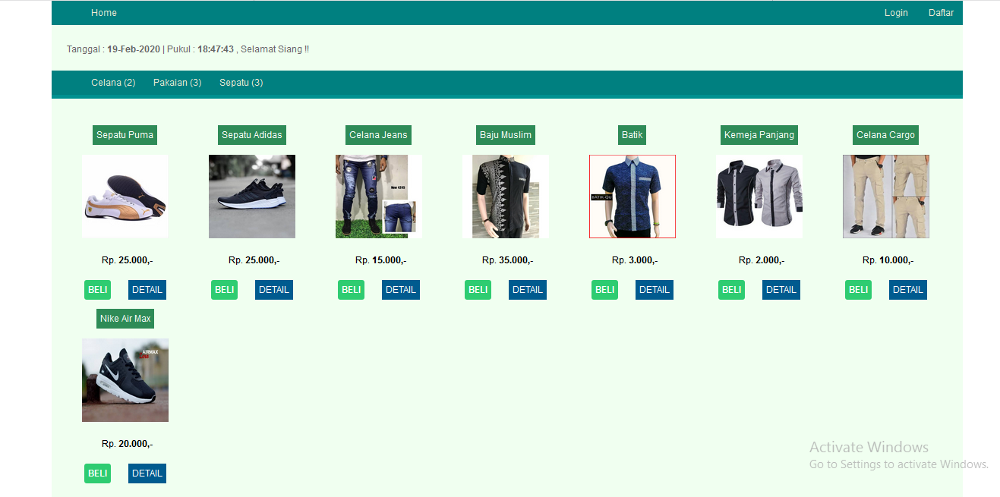
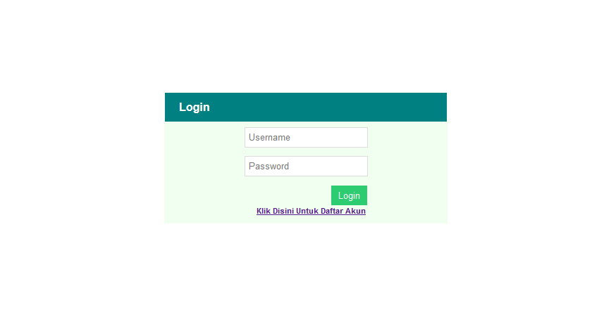

# Aplikasi e-commerce
Seperti yang anda ketahui bahwa Toko Online adalah salah satu contoh perkembangan teknologi yang semakin menggila. Dengan jaman yang serba canggih, tentu segala sesuatu pun menjadi lebih cepat alias instan. Berbelanja merupakan satu contoh nyata yang bisa kita rasakan perubahannya. Jaman dulu, kita bisa datang ke mall jika ingin membeli gadget, pakaian atau aksesoris, namun sekarang dengan adanya usaha toko online yang menyebar di seluruh Indonesia dan bahkan dunia, kini kita tidak perlu keluar dari rumah untuk mendapatkan apa yang diinginkan. Bahkan untuk membangun usaha toko online pun tidak perlu susah-susah asalkan sudah tahu produk apa yang ingin dipasarkan.
Dibangun dan dirancang menggunakan bahasa pemrograman PHP & MySQL yang mana tentunya merupakan bahasa pemrograman yang banyak digunakan dalam pembuatan sebuah aplikasi berbasis web.

# Gambar Aplikasi
* Halaman customer

* Halaman login customer

